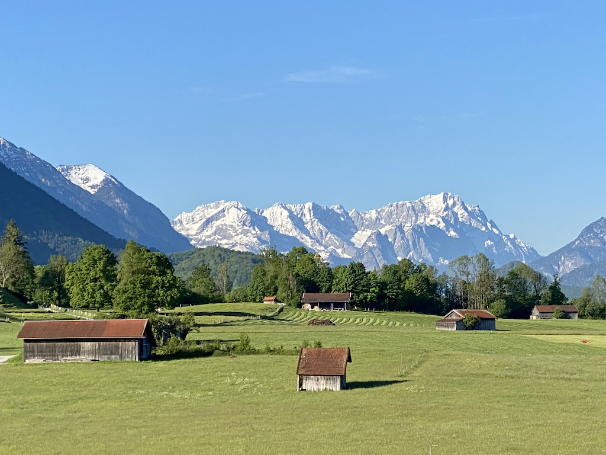

### Hi there 👋, I'm Harry

I am a passionate software craftsman that loves to code and always experiments with new technologies, frameworks and all other kinds of interesting tools.

- 💬 Ask me about:
  - Observability platforms such as [New Relic](https://www.newrelic.com)
  - [AI/LLM monitoring](https://newrelic.com/platform/ai-monitoring) capabilities for OpenAI, Gemini and others
  - [Dapr](https://dapr.io/): Distributed Application Runtime
  - [.NET Aspire](https://github.com/dotnet/aspire): opinionated, cloud ready stack for building observable, production ready, distributed applications
  - [Azure](https://azure.microsoft.com/en-us/), [AWS](https://aws.amazon.com/) and [GCP](https://cloud.google.com/)
  - [Zugspitz Region](https://www.zugspitz-region.de/) (see picture above) and [Greater Munich Metro region](https://www.metropolregion-muenchen.eu/)
- 📫 How to reach me:
  - Blue Sky: [https://bsky.app/profile/harry.kimpel.com](https://bsky.app/profile/harry.kimpel.com)
  - Mastodon: [https://hachyderm.io/@harrykimpel](https://hachyderm.io/@harrykimpel)
  - Twitter: [https://twitter.com/harrykimpel](https://twitter.com/harrykimpel)
  - LinkedIn: <https://www.linkedin.com/in/harrykimpel/>
  - Website: <https://www.kimpel.com>

